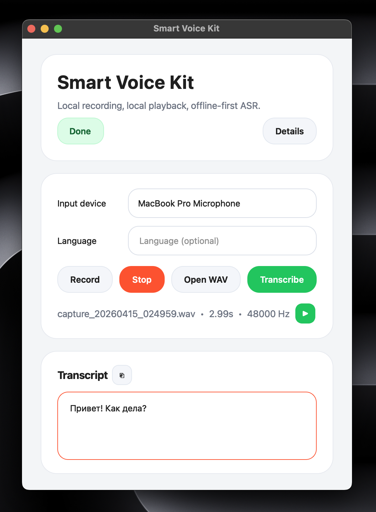
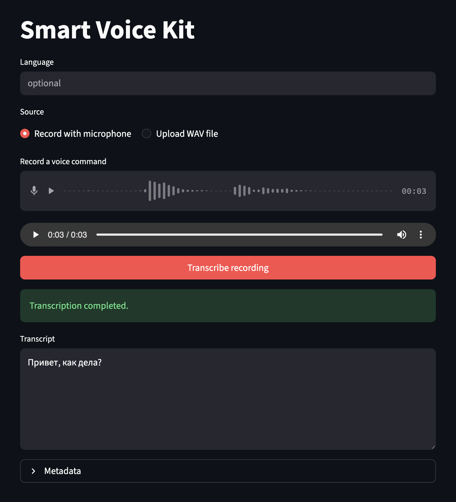
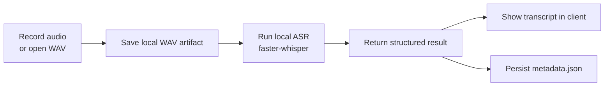
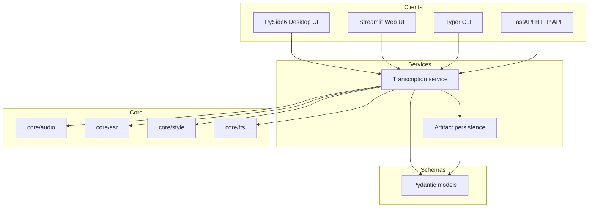

<div align="center">

# Smart Voice Kit

**Offline-first voice toolkit for local assistants, smart-device demos, and voice UX experiments**

<p>
  <a href="https://www.python.org/">
    
  </a>
  <a href="https://github.com/SYSTRAN/faster-whisper">
    
  </a>
  <a href="#requirements">
    
  </a>
  <a href="#offline-first-asr">
</p>

<p>
  <a href="https://doc.qt.io/qtforpython-6/">
    
  </a>
  <a href="https://docs.streamlit.io/">
    
  </a>
  <a href="https://fastapi.tiangolo.com/">
    
  </a>
  <a href="https://www.uvicorn.org/">
    
  </a>
</p>

Built for [Yandex Education Studcamp](https://education.yandex.ru/studcamp-mipt-cshse)

</div>


## What it is

Smart Voice Kit is a local-first foundation for voice interfaces.

It provides a clean, extensible codebase for recording audio, transcribing it with offline-capable ASR, exposing the same functionality through multiple clients, and saving structured run artifacts for later use.

The current version focuses on the transcription path, while keeping clear extension points for future style parsing and TTS.

## Why this project

- **Local-first by design** — the normal runtime path does not depend on cloud APIs
- **One shared service layer** — desktop UI, web UI, CLI, and API reuse the same core logic
- **Structured outputs** — runs are persisted as artifacts instead of being lost in terminal output
- **Built to grow** — style-aware speech control and TTS can be added without rewriting the architecture

## Current capabilities

| Area | Status |
| --- | --- |
| Audio input | Microphone capture and WAV ingestion |
| ASR | Local transcription via `faster-whisper` |
| Clients | Desktop UI, web UI, CLI, FastAPI |
| Persistence | Run-based artifacts in `runs/` |
| Config | Runtime parameters in `config.toml` |
| Extensibility | Reserved interfaces for style parsing and TTS |

## Screenshots

<table align="center">
  <tr>
    <td align="center"><b>Desktop UI</b></td>
    <td align="center"><b>Web UI</b></td>
  </tr>
  <tr>
    <td>
      
    </td>
    <td>
      
    </td>
  </tr>
</table>


## Quick start

```bash
python -m venv .venv
source .venv/bin/activate
pip install -e .
voice-cli prepare-asr
voice-desktop
```


## Installation

Minimal install:

```bash
pip install -e .
```

Development install:

```bash
pip install -e ".[dev]"
```

Runtime configuration lives in [`config.toml`](./config.toml).


## Requirements

- Python 3.11+
- macOS or Linux
- `ffmpeg` recommended for `faster-whisper`


## Offline-first ASR

By default, the runtime uses `local_files_only = true`, so regular transcription can run without network access after the model is prepared once.

Prepare the local model cache:

```bash
voice-cli prepare-asr
```

Force a redownload:

```bash
voice-cli prepare-asr --force
```

For fully explicit local model resolution, set `asr.model_path` to a converted local `faster-whisper` model directory.


## Running

### Desktop UI

```bash
voice-desktop
```

### Web UI

```bash
streamlit run app/ui_streamlit/main.py
```

### CLI

```bash
voice-cli prepare-asr
voice-cli transcribe-file samples/example.wav
voice-cli transcribe-last
```

### API

```bash
voice-api
curl http://127.0.0.1:8000/health
curl -X POST http://127.0.0.1:8000/transcribe/file -F "file=@samples/example.wav"
```


## Runtime flow




## Architecture




## Repository layout

```text
smart-voice-kit/
├── app/
│   ├── api/                  # FastAPI application and HTTP routes
│   ├── tui/                  # CLI commands and terminal workflows
│   ├── ui_desktop/           # PySide6 desktop client
│   └── ui_streamlit/         # Streamlit web client
├── core/
│   ├── audio/                # WAV I/O and audio helpers
│   ├── asr/                  # ASR interfaces and backend implementations
│   ├── style/                # future style parsing extension point
│   └── tts/                  # future TTS extension point
├── services/                 # orchestration and artifact persistence
├── schemas/                  # Pydantic models and structured results
├── assets/
│   └── images/               # README screenshots and visual assets
├── runs/                     # generated run artifacts and metadata
├── data/                     # local data and prepared resources
├── samples/                  # example WAV files for testing
├── config.toml               # runtime configuration
├── pyproject.toml            # project metadata and dependencies
└── README.md                 # project overview and usage guide
```


## Project structure by responsibility

| Path | Responsibility |
| --- | --- |
| `app/ui_desktop/` | Primary local desktop client |
| `app/ui_streamlit/` | Secondary browser client |
| `app/tui/` | CLI entrypoints |
| `app/api/` | HTTP API surface |
| `core/audio/` | WAV I/O and audio utilities |
| `core/asr/` | ASR interfaces and backends |
| `core/style/` | Future style parsing extension point |
| `core/tts/` | Future TTS extension point |
| `services/` | Orchestration and artifact persistence |
| `schemas/` | Structured models and result schemas |


## Metadata schema

Each run writes a `metadata.json` artifact with fields such as:

- `id`
- `timestamp`
- `duration_seconds`
- `sample_rate`
- `audio_path`
- `language`
- `transcript`
- `inference_seconds`
- `asr_backend`
- `model_name`


## Design principles

- all clients call the same business logic
- backend-specific code stays behind interfaces
- operations return structured models, not ad-hoc prints
- future style parsing and TTS should plug into the same flow cleanly


## Development

```bash
ruff check .
ruff format .
```


## Roadmap

- style-aware prompt parsing for speech control
- local TTS backends behind a shared interface
- richer audio preprocessing hooks
- more device-oriented runtime flows beyond plain WAV transcription
