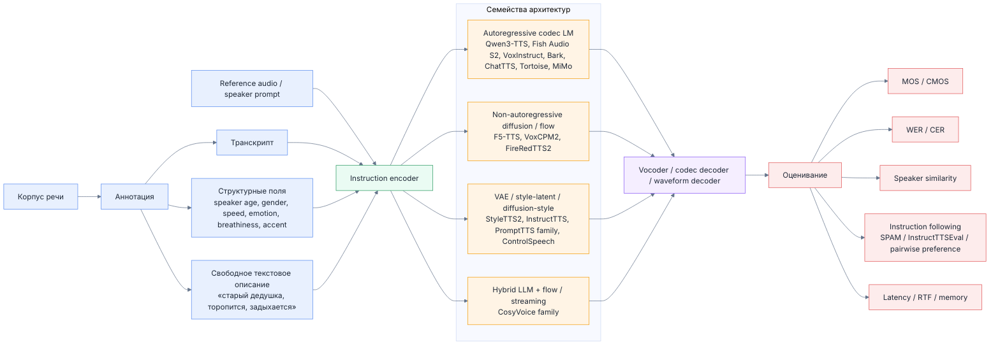

# Сравнительный обзор TTS-моделей для свободных текстовых инструкций

## Аннотация

Данный документ представляет собой сравнительный отчёт по TTS-моделям для сценариев вида: **«скажи это как старый дедушка, который очень торопится и задыхается»**. Документ основан на официальных материалах: model card, GitHub-репозитории, технические отчёты, документации по инференсу и fine-tuning, а также официальные API-страницы и научные статьи.

## Область охвата и методологические ограничения

Обзор охватывает открытые и закрытые TTS-системы, которые в официальных материалах демонстрируют хотя бы одну из следующих возможностей:

1. поддержка свободных текстовых инструкций для управления стилем речи;
2. voice design или controllable voice cloning;
3. открытые веса и/или формализованный путь локального использования;
4. публично описанный стек fine-tuning или адаптации.

Сравнение выполняется **только по официально подтверждённым источникам**, перечисленным в разделе источников. Если для конкретной модели официальный источник не раскрывает языковую матрицу, CPU-путь, режим квантования, лицензионный статус или детализацию fine-tuning, соответствующая оценка трактуется консервативно.

## Сводные выводы

| Сценарий | Модели, которые выделены как наиболее релевантные |
| --- | --- |
| Открытые и локально разворачиваемые кандидаты для instruct-TTS | Fish Audio S2 · Qwen3-TTS · VoxCPM2 |
| API-first сценарий без локального fine-tuning | Eleven v3 · Gemini Audio · GPT-4o-mini-TTS |
| CPU / edge / упрощённый локальный запуск | Piper · Kokoro |
| Voice cloning по короткому референсу | XTTSv2 · VoxCPM2 · Qwen3-TTS · FireRedTTS2 · ControlSpeech |
| Архитектурные исследовательские ориентиры | PromptTTS · PromptTTS2 · InstructTTS |

## Концептуальная схема

Ниже приведена концептуальная схема, отражающая общую логику постановки задачи и основные архитектурные семейства:

## Сравнительные таблицы по метрикам

> **Принцип чтения оценок.**  
> Используется шкала от **1 до 10**, где **10** означает наилучший результат **внутри рассматриваемой выборки по конкретной метрике**.  
> Если официальные источники не содержат достаточно прозрачных данных, соответствующая оценка оставлена консервативной.

## 1. Качество и выразительность речи

> **Назначение метрики.** Насколько естественно и выразительно звучит речь по официальным материалам: naturalness, prosody, emotion range, long-form stability, качество дикции и общий «frontier level» результата.

| Модель | Оценка | Комментарий |
| --- | --- | --- |
| VoxCPM2 | 9 | 48 кГц, 2M+ часов, voice design и controllable cloning; официально позиционируется как studio-quality/open commercial-ready. |
| Qwen3-TTS | 9 | 5M+ часов, 10 языков, explicit voice design / custom voice / cloning; официально ориентирован на expressive streaming TTS. |
| Fish Audio S2 | 10 | В official card заявлены fine-grained prosody/emotion control и strong benchmark claims; open flagship класса frontier TTS. |
| CosyVoice 3 | 9 | Officially claims strong content consistency, speaker similarity, prosody naturalness и zero-shot multilingual synthesis in the wild. |
| FireRedTTS2 | 8 | Силен на long conversational speech, context-aware prosody и stability, но уже более узко специализирован под dialogue/podcast. |
| Parler-TTS | 7 | Качество хорошее, но ставка больше на controllability и воспроизводимость, чем на абсолютный frontier naturalness. |
| XTTSv2 | 8 | Officially improved prosody/audio quality over v1 и силён по clone naturalness. |
| Piper | 6 | Сильнее всего как fast local TTS; официальные voice samples показывают хорошую практичность, но не frontier expressiveness. |
| VibeVoice | 9 | Официально нацелен на expressive long-form conversational audio с context-aware expression и speaker consistency. |
| Kokoro | 7 | Official card: «comparable quality to larger models», но тонкая выразительность ограничена lightweight форматом и voice inventory. |
| PromptTTS | 6 | Paper/demos показывают precise style control и high speech quality, но это ранняя research-stage система. |
| PromptTTS2 | 7 | Official paper claims better prompt consistency и richer voice variability than prior text-prompt baselines. |
| VoxInstruct | 8 | Direct instruction-to-speech setup и ACM MM oral; expressive demos и unified multilingual codec LM. |
| F5-TTS | 8 | Official project продвигает качество и faithful speech с flow matching; сильный open baseline. |
| CosyVoice family | 8 | Семейство в целом стабильно сильное по naturalness/ consistency/cloning, но не все версии equally instruction- centric. |
| Bark | 7 | Реалистичная multilingual speech и nonverbal audio, но speech stability/control слабее современных frontier TTS. |
| ChatTTS | 8 | Официально подчёркивает better prosody, dialogue optimization и control over laughter/pauses/interjections. |
| Tortoise | 8 | Исторически quality-first multi-voice TTS; official repo прямо делает акцент на realistic prosody and intonation. |
| MiMo-Audio-7B-Instruct | 9 | Official card заявляет open-source SOTA на instruct-TTS evals и сильные few-shot audio generation capabilities. |
| StyleTTS2 | 9 | Official paper claims human-level TTS on LJSpeech/VCTK и strong zero-shot speaker adaptation. |
| InstructTTS | 7 | Для 2023 paper-stage это сильная expressive TTS постановка с natural-language style prompt. |
| ControlSpeech | 8 | Official target - joint zero-shot cloning + style control; research positioning сильное. |
| Eleven v3 | 10 | Officially «most expressive» model компании; emotion/ direction/audio tags и 70+ languages. |
| GPT-4o-mini-TTS | 8 | Voice steering есть, streaming есть, но official emphasis меньше на maximal emotional range, чем у Eleven/Gemini. |
| Gemini Audio | 10 | Official docs подчёркивают granular natural-language control over style/accent/pace/tone/emotion и long-form multi-speaker output. |

## 2. Локальный запуск на CPU: возможность и удобство

> **Назначение метрики.** Насколько реалистично и удобно поднять модель локально без GPU: наличие CPU-friendly пути, лёгкость установки, вес модели, практичность inference на CPU/edge.

| Модель | Оценка | Комментарий |
| --- | --- | --- |
| VoxCPM2 | 2 | Official stack и perf numbers ориентированы на GPU/ VRAM; CPU путь не является основным. |
| Qwen3-TTS | 2 | Official docs рекомендуют FlashAttention 2 и GPU-style loading; CPU не позиционируется как practical path. |
| Fish Audio S2 | 1 | Official production path - SGLang + H200/GPU metrics; CPU-friendly режим публично не продвигается. |
| CosyVoice 3 | 3 | Локальный запуск есть, но official low-latency stack ориентирован на GPU/vLLM/Triton. |
| FireRedTTS2 | 2 | Official usage требует CUDA/GPU; CPU не заявлен как удобный runtime. |
| Parler-TTS | 6 | Модели сравнительно лёгкие, интеграция simple через Transformers/library; CPU возможен, хотя не optimal. |
| XTTSv2 | 5 | Локальный офлайн inference есть, но official examples ориентированы на CUDA; CPU - workable, но не самый удобный. |
| Piper | 10 | Piper прямо позиционируется как fast local TTS; ONNX и small models делают CPU запуск сильнейшим в списке. |
| VibeVoice | 1 | 3B BF16, long-form research stack; official CPU-friendly deployment не описан. |
| Kokoro | 9 | 82M params, pip package, lightweight design; один из наиболее простых локальных вариантов с поддержкой CPU. |
| PromptTTS | 1 | Официальных runnable open weights / local package не найдено; в official материалах это paper+demo. |
| PromptTTS2 | 1 | Официального локального runtime с весами не найдено; есть paper+demo. |
| VoxInstruct | 2 | Есть official inference code, но usage ориентирован на CUDA/GPU. |
| F5-TTS | 4 | Локально запускать можно, но official install и perf-маршрут в основном GPU-centric. |
| CosyVoice family | 3 | Семейство локально разворачивается, но на практике official fast path - GPU/streaming stack. |
| Bark | 4 | Official HF optimization guide поддерживает CPU offload, но сама модель тяжёлая. |
| ChatTTS | 4 | Локальный запуск есть, но official docs и optional vLLM говорят скорее о GPU-friendly сценарии. |
| Tortoise | 3 | Официально можно запускать локально, но проект известен как очень медленный. |
| MiMo-Audio-7B-Instruct | 1 | Official prerequisites: Linux, CUDA>=12.0, FlashAttention; CPU-путь не описан. |
| StyleTTS2 | 4 | Official repo есть, но out-of-box CPU convenience невысокая. |
| InstructTTS | 1 | Официального полноценно runnable CPU stack нет; в открытом виде это demo/paper . |
| ControlSpeech | 2 | Official repo исследовательский; CPU-friendly path публично не раскрыт. |
| Eleven v3 | 1 | Локальных весов нет; только облачный API/платформа. |
| GPT-4o-mini-TTS | 1 | Локального runtime нет; только API. |
| Gemini Audio | 1 | Локального runtime нет; только API/Cloud TTS. |

## 3. Простота интеграции

> **Назначение метрики.** Насколько просто встроить модель в приложение или сервис: качество SDK/API/CLI, наличие Docker/WebUI/FastAPI/Transformers/готовых runtime-маршрутов, зрелость developer experience.

| Модель | Оценка | Комментарий |
| --- | --- | --- |
| VoxCPM2 | 8 | Есть HF model card, docs, pip ecosystem и несколько runtimes. |
| Qwen3-TTS | 8 | qwen-tts package, HF weights, docs, released model split clear . |
| Fish Audio S2 | 8 | Official docs, GitHub, HF weights и server/WebUI/Docker маршруты. |
| CosyVoice 3 | 8 | Полный repo, docker , web UI, fastapi/client, demos. |
| FireRedTTS2 | 7 | Репо чистое, usage понятен, есть demo/UI; но стек уже более specialised. |
| Parler-TTS | 9 | HF ecosystem + open library + training/inference repo делают интеграцию одной из самых простых. |
| XTTSv2 | 9 | Coqui TTS API/CLI/docs - один из лучших DX среди open TTS. |
| Piper | 9 | CLI, ONNX, понятная training/export story и small binaries. |
| VibeVoice | 5 | Official HF card есть, но repo disabled - это заметно бьёт по интеграции. |
| Kokoro | 9 | Очень простой pip install, Python/JS paths, lightweight API. |
| PromptTTS | 2 | Official engineering surface отсутствует; фактически paper+demo+dataset. |
| PromptTTS2 | 2 | Аналогично: paper+demo, но не turnkey product. |
| VoxInstruct | 5 | Inference script есть, но меньше tooling и зрелости. |
| F5-TTS | 7 | Активное open repo, HF, demos - интеграция хорошая, хотя stack менее standardized, чем у Coqui/HF. |
| CosyVoice family | 8 | В целом семейство хорошо инструментировано для inference/deploy. |
| Bark | 8 | Official repo + HF model + Transformers support. |
| ChatTTS | 7 | Репо удобное, WebUI/CLI есть, но licensing и maturity ограничивают. |
| Tortoise | 6 | Интегрируется локально, но стек тяжёлый и медленный. |
| MiMo-Audio-7B-Instruct | 6 | HF + GitHub + toolkit есть, но общий audio-LLM stack сложнее TTS-специалистов. |
| StyleTTS2 | 6 | Open repo и scripts есть, но это всё ещё research code. |
| InstructTTS | 2 | В official open surface почти нет deployable code. |
| ControlSpeech | 4 | Repo есть, но toolkit-style, не turnkey serving stack. |
| Eleven v3 | 10 | Один из лучших production APIs по DX. |
| GPT-4o-mini-TTS | 10 | Очень простой API surface и official reference. |
| Gemini Audio | 9 | Cloud/API integration зрелая, но экосистема чуть более enterprise-biased. |

## 4. Удобство fine-tuning: формат данных, требования, риски поломки весов

> **Назначение метрики.** Насколько прозрачно и безопасно модель дообучать: опубликованный recipe, формат манифестов и аудио, поддержка LoRA/full fine-tuning, предупреждения о деградации качества, требования к VRAM и preprocessing.

| Модель | Оценка | Комментарий |
| --- | --- | --- |
| VoxCPM2 | 9 | Official FT guide очень конкретен: JSONL manifest, audio/ text/ref_audio, LoRA/full FT, VRAM estimates, warning про case/LoRA configs. |
| Qwen3-TTS | 8 | Officially base models пригодны для FT; single-speaker FT documented, но публичные детали датасхемы раскрыты слабее, чем у VoxCPM/Parler . |
| Fish Audio S2 | 7 | Official LoRA path есть, форматы .lab + audio + token extraction описаны; но docs прямо предупреждают, что FT RL-trained model может ухудшить качество. |
| CosyVoice 3 | 5 | Official repo упоминает training support, но именно CV3 FT-recipe и schema раскрыты ограниченно. |
| FireRedTTS2 | 8 | Есть официальный tutorial: JSONL/segments/speaker/ audio_path/text, token pre-extraction, адаптация под multilingual/dialogue data. |
| Parler-TTS | 9 | Один из лучших official FT stacks: speech + transcript + conditioning text description, open preprocessing, examples, dataset recipes. |
| XTTSv2 | 7 | Officially code-base supports fine-tuning и example recipes доступны, though detail granularity не такая полная, как у Parler/Piper/VoxCPM2. |
| Piper | 9 | Официальный training guide один из самых практичных: metadata.csv, dataset.jsonl, ONNX export, single/ multi-speaker FT. |
| VibeVoice | 3 | Official training details описывают pretraining/curriculum, но полноценного public FT guide почти нет. |
| Kokoro | 1 | Официальный inference stack есть, но public FT recipe не предоставлен. |
| PromptTTS | 2 | Dataset released, но official maintained FT/tooling для современного воспроизводимого fine-tuning отсутствует. |
| PromptTTS2 | 2 | Officially важен prompt generation pipeline, но готового FT workflow для пользователя нет. |
| VoxInstruct | 5 | Train scripts и input schema есть, но engineering maturity limited. |
| F5-TTS | 6 | Есть official custom dataset hooks и examples, но recipe менее turnkey и weights non-commercial. |
| CosyVoice family | 6 | Training support в repo есть, но в публичных official материалах схема меньше формализована. |
| Bark | 1 | Official FT path отсутствует. |
| ChatTTS | 2 | Official open-source release без SFT; пользовательский FT workflow не раскрыт. |
| Tortoise | 2 | Official repo делает акцент на inference/quality; FT recipe не является сильной стороной. |
| MiMo-Audio-7B-Instruct | 8 | Есть официальный training toolkit под SFT tasks, включая TTS/InstructTTS; но стек тяжелее и требует CUDA/ FlashAttention. |
| StyleTTS2 | 7 | Есть train_finetune scripts; как research FT base - сильный, но не turnkey production FT. |
| InstructTTS | 1 | Public demo/paper есть, official FT stack - нет. |
| ControlSpeech | 4 | Есть ControlToolkit/dataset references, но пользовательский FT stack ограничен. |
| Eleven v3 | 1 | Пользователь не дообучает модель в open sense; only cloned/custom voices via platform, не weight FT. |
| GPT-4o-mini-TTS | 1 | Open fine-tuning недоступен. |
| Gemini Audio | 1 | Open fine-tuning недоступен. |

## 5. Сила instruction / style control: поддержка свободных текстовых инструкций

> **Назначение метрики.** Насколько сильно модель умеет следовать свободным текстовым указаниям вроде «скажи это как старый дедушка, который торопится и задыхается», а не только фиксированным preset-меткам.

| Модель | Оценка | Комментарий |
| --- | --- | --- |
| VoxCPM2 | 9 | Voice design «from natural-language description» + controllable cloning со style guidance. |
| Qwen3-TTS | 9 | VoiceDesign и CustomVoice официально работают с instruct; один из сильнейших open вариантов. |
| Fish Audio S2 | 10 | Free-form [tag] control, 15k+ unique tags, not limited to fixed set, localized word-level conditioning. |
| CosyVoice 3 | 8 | Officially supports instructions for languages, dialects, emotions, speed, volume. |
| FireRedTTS2 | 6 | Контроль выражения больше через dialogue context / speaker-labeled format, чем через сильный free-form instruct channel. |
| Parler-TTS | 8 | Conditioning text description - core design principle; очень удобно для caption-style control. |
| XTTSv2 | 5 | Emotion/style transfer есть, но в основном через speech reference, не свободный text instruction. |
| Piper | 2 | Control в основном через voice/speed/noise params; свободный NL-style instruction официально отсутствует. |
| VibeVoice | 6 | Context-aware expression сильна, но explicit free-form instruct channel официально не главный. |
| Kokoro | 3 | Voice inventory и speed есть, но свободный style prompting публично не раскрыт. |
| PromptTTS | 8 | Именно «text descriptions → controllable speech» - core contribution. |
| PromptTTS2 | 9 | Variation network + text prompt is the entire method; very relevant architecturally. |
| VoxInstruct | 9 | Прямая instruction-to-speech постановка; optional speech prompt only дополняет текстовую инструкцию. |
| F5-TTS | 4 | Official emphasis - TTS quality/flow matching; explicit NL- style control слабее раскрыт. |
| CosyVoice family | 7 | От pronunciation control до emotions/speed/volume; хороший control, но менее open-ended, чем Fish/Qwen/ VoxCPM2. |
| Bark | 5 | Text-prompted audio + nonverbal tokens есть, но style control нестабилен и менее направляем. |
| ChatTTS | 6 | Fine-grained prosodic features, laughter , pauses, interjections - useful, но не полноценный open-ended instruct-TTS. |
| Tortoise | 4 | Сильнее в cloning/prosody, чем в свободных текстовых инструкциях. |
| MiMo-Audio-7B-Instruct | 9 | Instruct-tuned audio LM, официально силён на instruct-TTS evals. |
| StyleTTS2 | 5 | Latent style modeling очень сильна, но как free-form text instruction product - нет. |
| InstructTTS | 8 | Natural-language style prompt - центральная идея paper . |
| ControlSpeech | 8 | Zero-shot language style control - официально в названии и постановке задачи. |
| Eleven v3 | 10 | Inline audio tags, emotion, direction, mult-speaker; один из лучших коммерческих вариантов для prompt-style control. |
| GPT-4o-mini-TTS | 8 | Есть instructions parameter для steering voice; это сильнее классического TTS API, но слабее richest prompt systems. |
| Gemini Audio | 10 | Official natural-language prompts for style, accent, pace, tone, emotional expression. |

## 6. Мультиязычность: какие языки поддерживаются по официальным источникам

> **Назначение метрики.** Ширина и ясность официально заявленной языковой поддержки: количество языков, наличие диалектов, качество покрытия, cross-lingual / mixed-lingual режимы.

| Модель | Оценка | Комментарий |
| --- | --- | --- |
| VoxCPM2 | 9 | 30 языков: Arabic, Burmese, Chinese, Danish, Dutch, English, Finnish, French, German, Greek, Hebrew, Hindi, Indonesian, Italian, Japanese, Khmer , Korean, Lao, Malay, Norwegian, Polish, Portuguese, Russian, Spanish, Swahili, Swedish, Tagalog, Thai, Turkish, Vietnamese + 9 китайских диалектов. |
| Qwen3-TTS | 8 | 10 языков: Chinese, English, Japanese, Korean, German, French, Russian, Portuguese, Spanish, Italian. |
| Fish Audio S2 | 10 | Officially 80+ languages; перечислены Tier 1/2 и длинный tail list, включая English, Chinese, Japanese, Korean, Spanish, Portuguese, Arabic, Russian, French, German и десятки других. |
| CosyVoice 3 | 8 | 9 языков: Chinese, English, Japanese, Korean, German, Spanish, French, Italian, Russian + 18+ китайских диалектов/акцентов. |
| FireRedTTS2 | 7 | Officially listed: English, Chinese, Japanese, Korean, French, German, Russian. |
| Parler-TTS | 7 | Official multilingual v1.1: English, French, Spanish, Portuguese, Polish, German, Italian, Dutch. |
| XTTSv2 | 8 | 17 языков: English, Spanish, French, German, Italian, Portuguese, Polish, Turkish, Russian, Dutch, Czech, Arabic, Chinese, Japanese, Hungarian, Korean, Hindi. |
| Piper | 8 | Official samples/model zoo покрывают много языков и voice packs; breadth высок, но per-voice coverage uneven и семейство не единая panlingual model. |
| VibeVoice | 3 | Officially trained only on English and Chinese; другие языки прямо помечены как unsupported. |
| Kokoro | 7 | American English, British English, Japanese, Mandarin Chinese, Spanish, French, Hindi, Italian, Brazilian Portuguese; official card предупреждает о thin support для части non-English voices. |
| PromptTTS | 3 | Официальный PromptSpeech / demos - в основном English-centric; широкой multilingual matrix не опубликовано. |
| PromptTTS2 | 3 | Official paper говорит о 44K-hour dataset, но public multilingual support matrix в демо/пейпере не раскрыта. |
| VoxInstruct | 4 | Official lang_id: English/Chinese. |
| F5-TTS | 5 | Official public materials опираются на Emilia / WenetSpeech4TTS, но полного language support matrix не дают; multilingual breadth публично раскрыта неполно. |
| CosyVoice family | 8 | В официальном repo семейство заявляет 9 языков + 18+ китайских диалектов и cross-/mixed-lingual modes. |
| Bark | 7 | Officially multilingual, но в самих official snippets точный language list не детализирован. |
| ChatTTS | 4 | Officially supports Chinese and English. |
| Tortoise | 3 | Official repo не публикует сильную multilingual promise; модель исторически англоцентрична. |
| MiMo-Audio-7B-Instruct | 4 | Official card сильна по tasks/benchmarks, но публичного language list для Instruct version не даёт; because of that score conservative. |
| StyleTTS2 | 2 | Официальные benchmark/datasets - English single-/multi- speaker; multilingual support не заявлена как core capability. |
| InstructTTS | 3 | Official demo/paper не дают широкой multilingual matrix; public materials выглядят English-centric. |
| ControlSpeech | 4 | Official title обещает language style control, но public language coverage list в просмотренных source’ах не детализирован. |
| Eleven v3 | 10 | Officially 70+ languages. |
| GPT-4o-mini-TTS | 6 | Officially multiple languages, но voices currently optimized for English; полный public language matrix не дан в просмотренных TTS docs. |
| Gemini Audio | 10 | Officially 30 voices and 70+ locales; docs list many GA locale codes. |

## 7. Сила voice cloning

> **Назначение метрики.** Насколько сильна официально задокументированная поддержка клонирования голоса: zero-shot cloning, длина reference, cross-lingual cloning, controllable cloning, зрелость workflow.

| Модель | Оценка | Комментарий |
| --- | --- | --- |
| VoxCPM2 | 10 | Short-clip controllable cloning + reference+transcript “ultimate cloning”; один из наиболее сильных открытых стеков клонирования, явно описанных в официальных материалах. |
| Qwen3-TTS | 9 | 3-second rapid voice clone from reference audio/text; base model explicitly FT-capable. |
| Fish Audio S2 | 4 | В просмотренных official open docs S2 Pro акцент на instruction/prosody/streaming; явный cloning workflow для S2 Pro раскрыт слабо, score conservative. |
| CosyVoice 3 | 8 | Official repo подчёркивает zero-shot multi-/cross-lingual voice cloning. |
| FireRedTTS2 | 8 | Officially supports zero-shot voice cloning for cross-lingual/ code-switching scenarios. |
| Parler-TTS | 3 | Conditioning by text description и speaker names, но не classic speech-reference cloning. |
| XTTSv2 | 10 | Один из strongest official open cloning models: 6-second clip, cross-language cloning, multiple refs. |
| Piper | 1 | Voice cloning officially не является core feature. |
| VibeVoice | 2 | Model card скорее ограничивает impersonation cases; cloning как product feature не акцентирован. |
| Kokoro | 1 | Official card/usage не описывают cloning pipeline. |
| PromptTTS | 1 | Это text-description control, не speech-reference cloning. |
| PromptTTS2 | 1 | Variation/timbre via text and latent sampling, не voice cloning по speech prompt. |
| VoxInstruct | 5 | Optional speech prompt path есть, но cloning не так зрел/ широк, как у XTTS/VoxCPM/Qwen. |
| F5-TTS | 5 | Во просмотренных official snippets cloning capability раскрыта неполно, поэтому score conservative. |
| CosyVoice family | 8 | Zero-shot voice cloning - одна из core official family capabilities. |
| Bark | 3 | Speaker presets есть, но official true voice cloning не является core documented feature. |
| ChatTTS | 2 | Official open release прямо говорит о future zero-shot inference roadmap; public release focus - не cloning. |
| Tortoise | 9 | Сильный official multi-voice / voice cloning focus. |
| MiMo-Audio-7B-Instruct | 6 | Official card говорит о voice conversion/style transfer/ speech editing/few-shot learning, но separate cloning product path не детализирован. |
| StyleTTS2 | 8 | Official paper claims strong zero-shot speaker adaptation. |
| InstructTTS | 1 | Style prompting, не cloning. |
| ControlSpeech | 9 | Official goal - simultaneous zero-shot speaker cloning + style control. |
| Eleven v3 | 10 | Instant / Professional Voice Cloning officially documented and productized. |
| GPT-4o-mini-TTS | 4 | API reference допускает custom voice ID, но публичный cloning workflow в просмотренных docs не раскрыт полноценно. |
| Gemini Audio | 3 | Gemini-TTS docs акцентируют style prompting; custom voice в official stack связан скорее с Chirp custom voice, не open cloning workflow модели. |

## 8. Скорость и режимы реального времени: задержка, память, квантование, ONNX / INT8 и другие механизмы оптимизации

> **Назначение метрики.** Практическая скорость и управляемость inference: latency, time-to-first-audio, RTF, требования к VRAM, наличие streaming, quantization, ONNX/INT8/MLX/vLLM и других оптимизаций.

| Модель | Оценка | Комментарий |
| --- | --- | --- |
| VoxCPM2 | 8 | Official RTF ~0.30 / ~0.13 (Nano-vLLM), ~8 GB VRAM, плюс открытая ecosystem around ONNX/cpp/MLX. |
| Qwen3-TTS | 8 | Official latency as low as 97 ms; FlashAttention 2 reduces memory; streaming support. |
| Fish Audio S2 | 9 | Official RTF 0.195, TTFA ~100 ms, quantizations on HF tree, streaming engine. |
| CosyVoice 3 | 8 | Official latency ~150 ms, vLLM/Triton/TRT-LLM related roadmap/integration present. |
| FireRedTTS2 | 9 | Official FP latency 140 ms on L20; bf16 reduced VRAM from 14 GB to 9 GB. |
| Parler-TTS | 7 | Lightweight family, official optimizing inference material exists, but no extreme realtime claim like top streaming models. |
| XTTSv2 | 8 | Official stack supports streaming and Coqui repo notes <200 ms latency class. |
| Piper | 10 | Small ONNX-exportable models are its core advantage. |
| VibeVoice | 6 | Continuous 7.5 Hz tokenizer improves longform efficiency, но runtime всё ещё heavy: 3B BF16. |
| Kokoro | 10 | 82M params, official card прямо делает ставку на speed / cost-efficiency. |
| PromptTTS | 2 | Official realtime/product metrics не раскрыты. |
| PromptTTS2 | 2 | Official product/runtime metrics не раскрыты. |
| VoxInstruct | 4 | GPU inference script есть, но strong realtime/quantization claims нет. |
| F5-TTS | 8 | Official project продвигает stronger/faster training and inference; HF tree имеет quantizations. |
| CosyVoice family | 8 | Семейство исторически сильно по streaming и low latency. |
| Bark | 4 | Official CPU offload и bark-small помогают, но модель остаётся тяжёлой. |
| ChatTTS | 6 | Local inference reasonably usable, compile flag и optional vLLM documented, но no frontier latency claims. |
| Tortoise | 2 | Officially slow. |
| MiMo-Audio-7B-Instruct | 4 | 8B BF16, CUDA/flash-attn required; public low-latency claims modest. |
| StyleTTS2 | 6 | Research code, good quality, но official runtime optimization story limited. |
| InstructTTS | 2 | Official latency/runtime tooling отсутствуют. |
| ControlSpeech | 4 | Official realtime/quantization path не раскрыт. |
| Eleven v3 | 7 | Very strong service speed overall, но official real-time low- latency flag у компании скорее за Flash v2.5, не за v3 itself. |
| GPT-4o-mini-TTS | 9 | Streaming API, managed infra, simple speech endpoint. |
| Gemini Audio | 8 | GA long-form/single/multi-speaker TTS, production cloud infra; low-latency claims умеренные. |

## 9. Открытость и прозрачность: статья, репозиторий, model card, сообщество

> **Назначение метрики.** Насколько хорошо проект раскрыт официально: paper, GitHub, model card, документация, training/eval stack, лицензия, активность сообщества, воспроизводимость.

| Модель | Оценка | Комментарий |
| --- | --- | --- |
| VoxCPM2 | 10 | HF card + GitHub + docs + FT guide + permissive license. |
| Qwen3-TTS | 10 | Paper/report + GitHub + HF + docs + package + Apache. |
| Fish Audio S2 | 8 | Model card, paper , docs, code, weights есть; снизил балл из-за research license. |
| CosyVoice 3 | 9 | Repo, demos, papers, eval sets, HF/ModelScope - очень прозрачное семейство. |
| FireRedTTS2 | 8 | Repo + HF + tech report + demo + FT tutorial. |
| Parler-TTS | 10 | Один из самых open projects вообще: datasets, code, training stack, weights, org on HF. |
| XTTSv2 | 8 | Хорошая публичная документация и weights, но license менее свободен, чем Apache/MIT. |
| Piper | 9 | Отличная открытость, though original repo archived. |
| VibeVoice | 6 | Paper + HF card + model page есть, но repo disabled. |
| Kokoro | 8 | Open weights, repo, voices docs; dedicated academic paper on the exact model нет. |
| PromptTTS | 5 | Paper + demo + dataset, но полноценного official open stack нет. |
| PromptTTS2 | 5 | Paper + demo, но weights/production repo публично не выражены. |
| VoxInstruct | 7 | Paper + official repo + checkpoint/demos. |
| F5-TTS | 8 | Активный repo, HF, demos, paper; снижение за weights CC- BY-NC. |
| CosyVoice family | 9 | В целом семейство образцово открыто по сравнению с большинством TTS. |
| Bark | 8 | Official repo + HF + model card + Transformers ecosystem. |
| ChatTTS | 7 | Repo, HF, community активны, но model/data limitations существенны. |
| Tortoise | 8 | Repo и community strong, though engineering speed is old- school. |
| MiMo-Audio-7B-Instruct | 8 | HF cards, blog, training toolkit, eval toolkit, Apache. |
| StyleTTS2 | 8 | Пейпер + official repo + samples; very strong research transparency. |
| InstructTTS | 4 | Paper/demo есть, но открытой инженерной полноты мало. |
| ControlSpeech | 6 | Repo + arXiv + toolkit references; weights/licensing/public deployment details слабее. |
| Eleven v3 | 3 | Документация сильная, но веса/обучающие артефакты закрыты. |
| GPT-4o-mini-TTS | 3 | Official docs хорошие, но веса/архитектура/FT закрыты. |
| Gemini Audio | 3 | Official docs хорошие, но веса/архитектура/FT закрыты. |

## 10. Пригодность для производственного использования

> **Назначение метрики.** Насколько модель пригодна для реального продакшн-использования: стабильность, лицензия, зрелость runtime, задержка, стек интеграции и общая инженерная готовность.

| Модель | Оценка | Комментарий |
| --- | --- | --- |
| VoxCPM2 | 8 | Apache, commercial-ready positioning, streaming perf, FT docs - сильный кандидат. |
| Qwen3-TTS | 8 | Strong open stack, Apache, multilingual, cloning/design; good production potential. |
| Fish Audio S2 | 7 | Tech/sample-wise очень силён, но research/non- commercial license ограничивает прод. выбор. |
| CosyVoice 3 | 8 | Officially suitable for production-like use cases благодаря low latency, TN, pronunciation control. |
| FireRedTTS2 | 8 | Dialog/podcast specialization, low latency, FT tutorial; strong niche production fit. |
| Parler-TTS | 7 | Production-friendly openness, но raw quality/cloning меньше, чем у топовых open competitors. |
| XTTSv2 | 8 | Популярен в real apps, strong cloning, streaming, broad languages. |
| Piper | 9 | Один из лучших CPU/embedded/ONNX production options. |
| VibeVoice | 2 | Official card прямо не рекомендует commercial/real-world use без further testing and development. |
| Kokoro | 8 | Lightweight, Apache, deployable anywhere according to model card. |
| PromptTTS | 2 | Исследовательский ориентир, а не production-артефакт. |
| PromptTTS2 | 2 | Исследовательский ориентир, а не production-артефакт. |
| VoxInstruct | 5 | Интересный instruct prototype, но экосистема скромная. |
| F5-TTS | 6 | Сильный open model, но non-commercial weights ограничивают реальный прод. выбор. |
| CosyVoice family | 8 | Strong full-stack story for serving/training/deployment. |
| Bark | 5 | Полезен, но audio-generalist и менее предсказуем как production TTS. |
| ChatTTS | 3 | Officially academic only; production suitability intentionally limited. |
| Tortoise | 5 | Качество сильное, но speed плохая; production use возможен, но неудобен. |
| MiMo-Audio-7B-Instruct | 7 | Strong general audio-instruction stack и official training/eval tooling, но heavier than dedicated TTS. |
| StyleTTS2 | 5 | Excellent research base, менее turnkey для продакшна. |
| InstructTTS | 2 | Исследовательский уровень зрелости. |
| ControlSpeech | 4 | Практический production stack в official materials limited. |
| Eleven v3 | 10 | Наиболее зрелый сервисный вариант в данной выборке. |
| GPT-4o-mini-TTS | 9 | API хорошо подходит для производственного использования, но меньше speech- specialized control, чем у лидеров TTS. |
| Gemini Audio | 9 | Production cloud TTS с strong controllability и locale coverage. |

## 11. Лицензия и ограничения

> **Назначение метрики.** Насколько лицензия благоприятна для реального использования: permissive open-source лицензии получают высокий балл, research-only / non-commercial / proprietary ограничения — низкий.

| Модель | Оценка | Комментарий |
| --- | --- | --- |
| VoxCPM2 | 9 | Apache-2.0. |
| Qwen3-TTS | 9 | Apache-2.0. |
| Fish Audio S2 | 3 | Fish Audio Research License; research/non-commercial only, commercial via separate license. |
| CosyVoice 3 | 9 | Apache-2.0. |
| FireRedTTS2 | 9 | Apache-2.0. |
| Parler-TTS | 9 | Apache-2.0. |
| XTTSv2 | 6 | Coqui Public Model License; не настолько свободна, как Apache/MIT. |
| Piper | 9 | MIT. |
| VibeVoice | 5 | HF card указывает MIT, но model card одновременно ограничивает use до research purpose и out-of-scope misuse. |
| Kokoro | 9 | Apache-2.0. |
| PromptTTS | 2 | В найденных official paper/demo лицензия на модель/код явно не указана. |
| PromptTTS2 | 2 | В найденных official paper/demo лицензия явно не указана. |
| VoxInstruct | 8 | MIT для code and weights. |
| F5-TTS | 4 | Code MIT, но pretrained weights CC-BY-NC. |
| CosyVoice family | 9 | Apache-2.0. |
| Bark | 9 | MIT; commercial use officially permitted. |
| ChatTTS | 3 | Code AGPLv3+, model CC BY-NC 4.0; academic/research only. |
| Tortoise | 9 | Apache-2.0. |
| MiMo-Audio-7B-Instruct | 9 | Official GitHub license Apache-2.0. |
| StyleTTS2 | 8 | MIT. |
| InstructTTS | 2 | В найденных official material license не указана. |
| ControlSpeech | 2 | В просмотренных official sources license явно не указана. |
| Eleven v3 | 2 | Проприетарный сервис / ToS, open weights отсутствуют. |
| GPT-4o-mini-TTS | 2 | Проприетарный API, open weights отсутствуют. |
| Gemini Audio | 2 | Проприетарный cloud/API offer , open weights отсутствуют. |

## Официальные источники по моделям

| Модель | Официальные ссылки |
| --- | --- |
| VoxCPM2 | [Hugging Face model card](https://huggingface.co/openbmb/VoxCPM2), [Official fine-tuning docs](https://voxcpm.readthedocs.io/en/latest/finetuning/finetune.html) |
| Qwen3-TTS | [Hugging Face model card](https://huggingface.co/Qwen/Qwen3-TTS-12Hz-0.6B-Base), [Official GitHub repository](https://github.com/QwenLM/Qwen3-TTS) |
| Fish Audio S2 | [Hugging Face model card](https://huggingface.co/fishaudio/s2-pro), [Official docs / model overview](https://speech.fish.audio/), [Official fine-tuning docs](https://github.com/fishaudio/fish-speech/blob/main/docs/en/finetune.md) |
| CosyVoice 3 | [Official project page](https://funaudiollm.github.io/cosyvoice3/), [Official GitHub repository](https://github.com/FunAudioLLM/CosyVoice) |
| FireRedTTS2 | [Hugging Face model card](https://huggingface.co/FireRedTeam/FireRedTTS2), [Official fine-tuning tutorial](https://github.com/FireRedTeam/FireRedTTS2/blob/main/bin/finetune_example/tutorial.md) |
| Parler-TTS | [Hugging Face organization](https://huggingface.co/parler-tts), [Multilingual model card](https://huggingface.co/parler-tts/parler-tts-mini-multilingual-v1.1), [Training README](https://github.com/huggingface/parler-tts/blob/main/training/README.md) |
| XTTSv2 | [Hugging Face model card](https://huggingface.co/coqui/XTTS-v2) |
| Piper | [Official GitHub repository](https://github.com/rhasspy/piper), [Official training guide](https://github.com/rhasspy/piper/blob/master/TRAINING.md) |
| VibeVoice | [Hugging Face model card](https://huggingface.co/microsoft/VibeVoice-1.5B) |
| Kokoro | [Hugging Face model card](https://huggingface.co/hexgrad/Kokoro-82M), [Official voices file](https://huggingface.co/hexgrad/Kokoro-82M/blob/main/VOICES.md) |
| PromptTTS | [Official project page](https://speechresearch.github.io/prompttts/) |
| PromptTTS2 | [Official project page](https://speechresearch.github.io/prompttts2/) |
| VoxInstruct | [Official GitHub repository](https://github.com/thuhcsi/voxinstruct) |
| F5-TTS | [Official GitHub repository](https://github.com/swivid/f5-tts), [Hugging Face model card](https://huggingface.co/SWivid/F5-TTS) |
| CosyVoice family | [Official project page](https://funaudiollm.github.io/cosyvoice3/), [Official GitHub repository](https://github.com/FunAudioLLM/CosyVoice) |
| Bark | [Hugging Face model card](https://huggingface.co/suno/bark), [Official GitHub repository](https://github.com/suno-ai/bark), [Optimization guide](https://huggingface.co/blog/optimizing-bark) |
| ChatTTS | [Official GitHub repository](https://github.com/2noise/chattts) |
| Tortoise | [Official GitHub repository](https://github.com/neonbjb/tortoise-tts) |
| MiMo-Audio-7B-Instruct | [Hugging Face model card](https://huggingface.co/XiaomiMiMo/MiMo-Audio-7B-Instruct), [Training toolkit](https://github.com/XiaomiMiMo/MiMo-Audio-Training), [License](https://github.com/XiaomiMiMo/MiMo-Audio/blob/main/LICENSE) |
| StyleTTS2 | [Official GitHub repository](https://github.com/yl4579/styletts2) |
| InstructTTS | [Official GitHub repository / demo](https://github.com/yangdongchao/InstructTTS) |
| ControlSpeech | [Official GitHub repository](https://github.com/jishengpeng/ControlSpeech) |
| Eleven v3 | [Official model page](https://elevenlabs.io/v3), [Models overview](https://elevenlabs.io/docs/overview/models), [Professional voice cloning docs](https://elevenlabs.io/docs/eleven-creative/voices/voice-cloning/professional-voice-cloning) |
| GPT-4o-mini-TTS | [OpenAI TTS guide](https://developers.openai.com/api/docs/guides/text-to-speech), [Speech API reference](https://developers.openai.com/api/reference/resources/audio/subresources/speech/methods/create/) |
| Gemini Audio | [Gemini TTS docs](https://docs.cloud.google.com/text-to-speech/docs/gemini-tts), [Custom voice docs](https://docs.cloud.google.com/text-to-speech/docs/chirp3-instant-custom-voice) |
